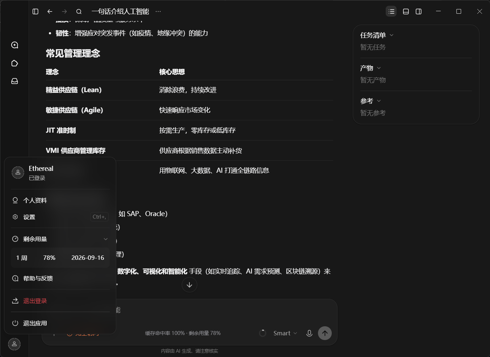

# MiMo 缓存用量状态条

> **MiMo Composer Token Status**  
> Agent-Native Runtime Extension for Xiaomi MiMo Desktop  
> 非官方社区项目 · **Unofficial** · 与 Xiaomi 无关联（not affiliated with Xiaomi）

面向 **Xiaomi MiMo Desktop** 的轻量级本地 Runtime Extension。

在 **Composer Footer** 中显示：

```text
缓存命中率 96% · 剩余用量 72%
```

**真机效果（Live）** — Composer 底栏与账户菜单「剩余用量」同源对照：



图中可见：

- Composer Footer：`缓存命中率 100% · 剩余用量 78%`
- 账户菜单「剩余用量」：`1 周 · 78% · 2026-09-16`（同一 Token Plan 数据源）

复用 MiMo 已有的本地 Usage State 与 Native Usage API，通过 **本机 CDP** 完成 Runtime Injection。

- 不修改 `app.asar`
- 不修改 MiMo 可执行文件
- **0** 额外 LLM 请求
- 无云端服务
- 无 Telemetry / Analytics
- Event-driven 刷新
- Agent-native 安装

---

## 功能 Features

| 指标 | English | 含义 |
|------|---------|------|
| 缓存命中率 | **Cache Hit Rate** | 当前会话累计 Prompt Cache 命中率 |
| 剩余用量 | **Usage Left / Plan Remaining** | MiMo 账户 **Token Plan** 剩余用量 |

**不是** Context Window 剩余，**不是** Context Ring 水位。

窄窗口可降级为：`命中率 96% · 剩余 72%`。

---

## 为什么需要它 Why

MiMo 已在不同界面暴露会话缓存与账户用量信息。本项目把最有用的两个信号放到 **Composer 底栏中央**，且不改动应用安装包。

---

## 工作原理 Architecture

```text
User → Xiaomi MiMo Desktop
              │
              │  localhost CDP (127.0.0.1:9222)
              ▼
        Bootstrap / Launcher
              │
              ▼
     Frozen runtime-inject.js
              │
              ├── usageByConvo  → Cache Hit Rate
              ├── getUserUsage() → Plan Remaining
              └── harnessDone / chatDone / usage → refresh
              │
              ▼
        Composer Footer
        缓存命中率 XX% · 剩余用量 XX%
```

| 层级 | 说明 |
|------|------|
| Timers | **0** |
| MutationObservers | **0** |
| Additional LLM Requests | **0** |
| External production network | **0**（仅本机 CDP） |

Refresh：原生 completion / usage 事件 + microtask 去重，**不是**秒级轮询。

---

## 数据来源 Data sources

| 指标 | 来源 |
|------|------|
| Cache Hit Rate | `Pje` → `usageByConvo` → 当前 active conversation |
| Plan Remaining | `window.mimo.getUserUsage()` → `usage.percent` |

---

## 指标定义 Metrics

### 缓存命中率 Cache Hit Rate

```text
cacheHitRate = cacheRead / max(cacheRead + cacheWrite + input, 1)
```

- `input` = fresh / 未命中缓存的输入 tokens  
- `cacheRead` = prompt cache 读取 tokens  
- `cacheWrite` = cache 写入 tokens（不算命中）  
- 范围：**当前会话累计**

### 剩余用量 Token Plan Remaining Usage

```text
window.mimo.getUserUsage()
  → { percent, resetDate }

planRemainingRatio = percent / 100
```

与 MiMo 账户菜单「剩余用量」同源。  
**明确不是** Context Window Remaining / Context Ring。

---

## 安装 Installation

### Agent 安装（推荐）

1. 将本仓库交给 **MiMo Agent**（或打开仓库所在对话）  
2. 说明：**「安装这个项目」** / **install this project**  
3. Agent 按 [AGENTS.md](AGENTS.md) 执行：

```powershell
powershell -NoProfile -ExecutionPolicy Bypass -File .\installer\install.ps1
powershell -NoProfile -ExecutionPolicy Bypass -File .\installer\verify.ps1
```

安装器会：

- 复制到用户目录（**无需管理员**）  
- 注册用户级 Bootstrap  
- 将桌面/开始菜单的 **Xiaomi MiMo** 快捷方式包装为带 CDP 启动（**名称与图标不变**）  
- 写入 rollback，卸载可恢复  

### 日常使用

安装后点击桌面 / 开始菜单的 **Xiaomi MiMo** 即可。  
**不需要**日常使用 `npm` 或 PowerShell。

### 开发者模式 Developer mode

```powershell
npm run connect
npm run check
npm run verify
npm run e2e:debug
```

---

## 兼容性 Compatibility

| 平台 | 状态 |
|------|------|
| Windows 10/11 | **支持** |
| Xiaomi MiMo Desktop | **支持** |
| macOS | 暂不支持 |
| Linux | 暂不支持 |
| Installer-wrapped **Xiaomi MiMo** 快捷方式 | **支持** |
| 原始 `Xiaomi MiMo.exe` 直接双击（无 CDP） | **不支持**（见限制） |

MiMo 内部结构（`Pje` / `usageByConvo` / `getUserUsage` / 事件）**版本敏感**。详见 [docs/COMPATIBILITY.md](docs/COMPATIBILITY.md)。

---

## 安全性 Security

- 无 Telemetry / Analytics / 云端服务  
- 不收集 Cookie / Token / 密码  
- 不上传 Prompt / 对话  
- **0** 额外 LLM 请求  
- 不修改 `app.asar` / `Xiaomi MiMo.exe`  
- 生产外部网络请求：**0**；唯一本机通信：`127.0.0.1:9222`（CDP）

详见 [SECURITY.md](SECURITY.md)。

---

## 已知限制 Limitations

- 依赖安装器包装后的 **Xiaomi MiMo** 快捷方式开启 CDP  
- 从安装目录直接双击原始 `Xiaomi MiMo.exe` **无法**在进程启动后开启 CDP（需改宿主，本项目不做）  
- MiMo 大版本更新可能导致内部选择器失效  

---

## 项目结构 Layout

```text
composer-token-status/
├── AGENTS.md
├── README.md
├── SPEC.md
├── LICENSE
├── SECURITY.md
├── CHANGELOG.md
├── inject/          # frozen runtime + CDP
├── bootstrap/       # discovery / inject / health
├── installer/       # install / uninstall / repair / verify
├── docs/
└── scripts/
```

---

## License

This project is licensed under the **MIT License**（见 [LICENSE](LICENSE)）。

This project is **unofficial** and is **not affiliated with, endorsed by, or sponsored by Xiaomi**.

---

## English

### Overview

**MiMo 缓存用量状态条** (English: **MiMo Composer Token Status**) is an agent-native local runtime extension for **Xiaomi MiMo Desktop**. It shows two indicators in the Composer footer:

```text
Cache Hit Rate 96% · Usage Left 72%
```

Live screenshot (same session): Composer footer matches the account menu **剩余用量**.


It reuses MiMo’s existing local usage state and native account usage API via **localhost CDP** injection. It does **not** modify `app.asar` or the MiMo executable, makes **no extra LLM requests**, and uses **no cloud or telemetry**.

### Features

- Cache Hit Rate (conversation cumulative prompt-cache hits)
- Token Plan Usage Remaining (account menu source)
- Event-driven refresh (harness/chat completion + usage events)
- Agent-first installation + user-level bootstrap
- Shortcut wrap with rollback / repair / uninstall
- Zero timers / zero MutationObservers in the production runtime

### Architecture

```text
User → MiMo Desktop → localhost CDP → frozen runtime injector → Composer footer
Cache:  Pje → usageByConvo → cacheRead / (cacheRead + cacheWrite + input)
Plan:   window.mimo.getUserUsage() → percent / 100
```

### Installation

Give this repository URL to a MiMo Agent and say **install this project**. The agent runs `installer/install.ps1` and `installer/verify.ps1` per [AGENTS.md](AGENTS.md). Daily use: open the desktop **Xiaomi MiMo** icon.

### Compatibility

Windows 10/11 + Xiaomi MiMo Desktop. macOS/Linux not supported. Raw `Xiaomi MiMo.exe` without CDP cannot be attached. Internals are version-sensitive.

### Security

No telemetry, analytics, cloud sync, cookie/token collection, or additional LLM requests. Local CDP only (`127.0.0.1:9222`). See [SECURITY.md](SECURITY.md).

### License

MIT. Unofficial; not affiliated with Xiaomi.
